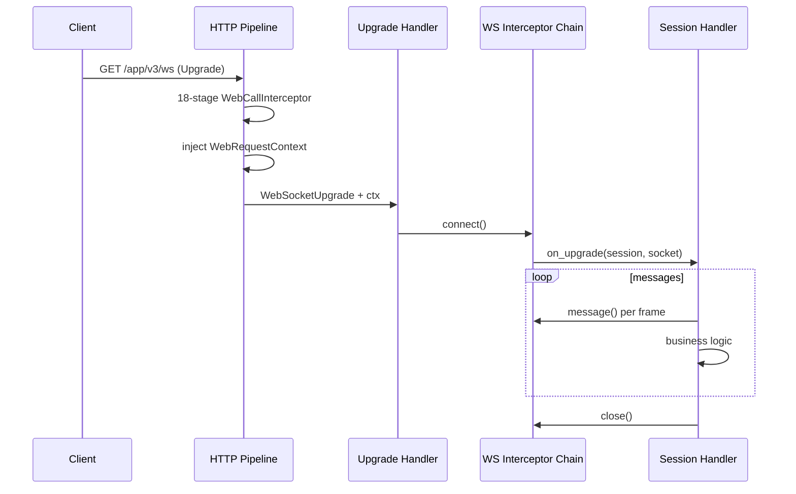

# WebSocket 统一标准

> 前置阅读：[04-pipeline-interceptor-design.md](./04-pipeline-interceptor-design.md)、[03-web-request-context.md](./03-web-request-context.md)  
> 实现：`sdkwork-web-core::websocket` + `sdkwork-web-axum::websocket`

## 1. 设计目标

WebSocket 与 HTTP **共用同一套调用体系**：

| 能力 | HTTP | WebSocket |
| --- | --- | --- |
| 请求上下文 | `WebRequestContext` | 升级后写入 `WebSocketSession.request_context` |
| 拦截器链 | `WebCallInterceptorChain` | `WebSocketCallInterceptorChain` |
| 运行时 | `WebCallRuntime` | `WebSocketCallRuntime`（类型别名） |
| 解析/策略 | `WebRequestContextResolver` + `SecurityPolicy` | 复用同一 `WebCallRuntime` |
| Handler 注入 | `FromRequestParts<WebRequestContext>` | 升级 handler 参数 `ctx: WebRequestContext` |

框架 **零业务依赖**；IAM、租户策略等通过 resolver 与 `DomainContextInjector` 注入。

## 2. 生命周期



### 阶段说明

1. **HTTP 升级前**：必须经过 `with_server_request_identity` + `with_web_request_context`，与 REST 路由相同。
2. **升级 handler**：签名 `async fn(ws: WebSocketUpgrade, ctx: WebRequestContext) -> Response`，使用 `run_websocket_session`。
3. **连接建立**：`WebSocketCallInterceptorChain::connect`（`on_connect` 阶段）。
4. **消息循环**：每条入站消息前调用 `message()`（`on_message` 阶段）；业务 handler 负责读写 socket。
5. **连接关闭**：`close()`（`on_close` 阶段，逆序）。

## 3. 核心类型

### WebSocketSession

```rust
pub struct WebSocketSession {
    pub connection_id: ServerRequestId,
    pub request_context: WebRequestContext,
}
```

- `connection_id`：连接级 ID，与 HTTP `request_id` 区分。
- `request_context`：自 HTTP pipeline 注入，含 `principal`、`tenancy`、`app` 等分组字段。
- 便捷方法：`tenant_id()`、`app_id()`、`ctx()`。

### WebSocketCallInterceptor

```rust
#[async_trait]
pub trait WebSocketCallInterceptor<R>: Send + Sync + 'static
where
    R: WebRequestContextResolver + Clone,
{
    fn name(&self) -> &'static str;
    fn stage(&self) -> WebSocketCallStage; // Connect | Message | Close

    async fn on_connect(&self, state: &mut WebSocketCallState, runtime: &WebSocketCallRuntime<R>) -> Result<(), WebFrameworkError>;
    async fn on_message(&self, state: &mut WebSocketCallState, runtime: &WebSocketCallRuntime<R>) -> Result<(), WebFrameworkError>;
    async fn on_close(&self, state: &WebSocketCallState, runtime: &WebSocketCallRuntime<R>) -> Result<(), WebFrameworkError>;
}
```

### WebSocketCallState

```rust
pub struct WebSocketCallState {
    pub session: WebSocketSession,
    pub message_index: u64,
}
```

`message_index` 从 1 递增，供限流、审计、幂等等扩展使用。

## 4. Axum 装配

```rust
use sdkwork_web_axum::{
    run_websocket_session, with_server_request_identity, with_web_request_context,
    WebFrameworkLayer, WebSocketUpgradeLayer,
};
use sdkwork_web_core::{
    DefaultWebRequestContextResolver, WebRequestContext, WebSocketCallInterceptorChain,
    WebSocketCallRuntime,
};
use std::sync::Arc;

let resolver = DefaultWebRequestContextResolver::default();
let http_layer = WebFrameworkLayer::new(resolver.clone());
let ws_layer = WebSocketUpgradeLayer {
    ws_chain: Arc::new(WebSocketCallInterceptorChain::new()),
    http_runtime: Arc::new(WebSocketCallRuntime::new(resolver)),
};

let app = with_web_request_context(
    with_server_request_identity(router),
    http_layer,
);

// 路由
router.route("/app/v3/ws", get(|ws, ctx: WebRequestContext| async move {
    run_websocket_session(ws, ctx, ws_layer, |session, socket| async move {
        // session.ctx() 含 tenant / principal
    })
}))
```

### echo_with_interceptors

对简单 echo 场景，可使用 `sdkwork_web_axum::echo_with_interceptors`，在消息循环内自动调用 `message()` / `close()`。

## 5. 与 HTTP Pipeline 的对齐规则

| 规则 ID | 说明 |
| --- | --- |
| WS-I1 | WebSocket 路由 **必须** 挂在已启用 HTTP pipeline 的 Router 上 |
| WS-I2 | 升级 handler **禁止** 手工 `Extension::<WebRequestContext>` 提取；使用 `FromRequestParts` |
| WS-I3 | 认证在 HTTP 阶段完成；WS 阶段 **不得** 重新解析 Authorization 头（除非业务自定义 interceptor 明确要求） |
| WS-I4 | `WebSocketCallRuntime` 与 HTTP 共用 resolver / security policy |
| WS-I5 | 自定义 WS interceptor 不得绕过 `connect` 直接执行业务 |
| WS-I6 | 拒绝连接使用 `WebFrameworkError::websocket_rejected` |

## 6. 扩展点

| EP | 名称 | 说明 |
| --- | --- | --- |
| EP-WS-01 | `WebSocketCallInterceptor` | 连接/消息/关闭三阶段扩展 |
| EP-WS-02 | `DomainContextInjector` | HTTP 阶段注入领域 Extension，WS 可从 `session.ctx()` 读取 |
| EP-WS-03 | `WebSocketCallInterceptorChain::with_interceptor` | 注册顺序即 connect 正序、close 逆序 |

标准库 **不提供** 默认 WS interceptor 链（与 HTTP 18 阶段不同）；业务按域装配（心跳、订阅鉴权、房间路由等）。

## 7. 错误与响应

- HTTP 升级失败：返回 Problem+JSON（与 HTTP pipeline 一致）。
- 连接/消息拦截失败：`on_connect` / `on_message` 返回 `Err` 时，axum 层关闭 socket 或中断循环。
- `WebFrameworkErrorKind::WebSocketRejected` → HTTP 400。

## 8. 成熟度

| 级别 | 能力 |
| --- | --- |
| M1 | HTTP 升级 + `WebRequestContext` 注入 + 空 WS 链 |
| M2 | 标准 WS interceptor（心跳、鉴权复验） |
| M3 | 与 claw-router 事件总线桥接（业务 crate） |
| M4 | 分布式连接元数据 store |

当前实现：**M1**（core + axum 封装，集成测试覆盖升级路径）。
